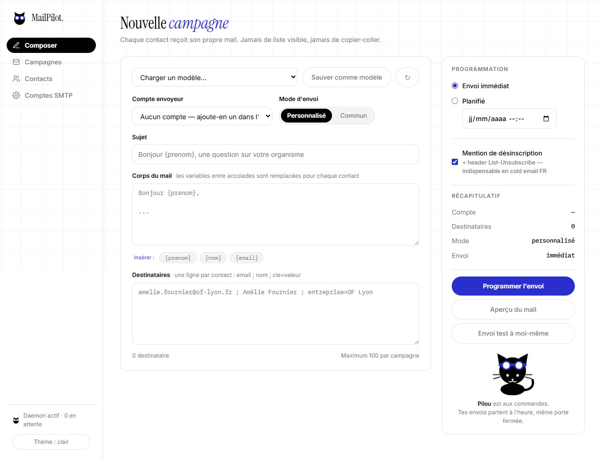

# MailPilot ✈️🐱

Envoi d'emails programmables en local, pilotable depuis Claude Code via MCP, avec dashboard web. Mascotte officielle : Pilou.



> 📖 **Nouveau ici ?** Le [guide pas à pas](docs/guide.md) t'accompagne de l'installation à ta première campagne. La [landing page](https://wvxv8rmzwb-dev.github.io/MailPilot/) présente le fonctionnement en 3 étapes.

## Ce que ça fait

- **Chaque destinataire reçoit son propre mail** (jamais de liste visible en `To`/`Cc`)
- **Personnalisation par variables** : `{prenom}`, `{nom}`, `{entreprise}`... remplacées contact par contact, plus des **variables globales** définies une fois dans Réglages (`{signature}`, `{lien_calendly}`...)
- **Corps texte ou HTML complet** : fallback texte dégradé automatiquement, variables dans les deux
- **Pièces jointes** : ajoute un PDF ou une image au Composer (10 Mo max), chaque destinataire reçoit sa copie
- **Programmation** date/heure : le daemon envoie même session Claude Code fermée
- **Relances automatiques** : un follow-up part N jours après, aux destinataires servis
- **Cap 500 destinataires** par campagne (réglable via `max_recipients`), délai inter-envois par défaut 3 s
- **Doublons filtrés** : un même email ne reçoit qu'un seul mail par campagne
- **Liste de suppressions** : un contact désinscrit est exclu automatiquement de toutes les campagnes et relances futures du compte
- **Relance des échecs** : bouton « Relancer » (dashboard) ou `retry_failed_campaign` (MCP)
- **Cooldown inter-campagnes** : un contact servi il y a moins de 7 jours (réglable) est exclu avec avertissement — jamais de double sollicitation rapprochée
- **Historique par contact** : clique sur un contact dans l'onglet Contacts — toutes ses campagnes, dates, statuts et désinscriptions
- **Surveillance IMAP des réponses** : les « STOP » et bounces durs détectés dans la boîte de réception désinscrivent automatiquement (bounces temporaires ignorés)
- **Warm-up progressif** : un compte neuf monte en charge tout seul (~15/jour, +15 par jour) — le plafond le plus strict s'applique
- **Rapport quotidien** : chaque soir, les comptes actifs reçoivent chez eux leur récap (envois, quota, échecs, campagnes à venir)
- **Retry automatique** des erreurs réseau temporaires (backoff 5 s / 15 s in-send + un essai auto 15 min après un échec global temporaire)
- **Désinscription** : mention en pied de mail + headers `List-Unsubscribe` (activée par défaut)
- **Limite quotidienne par compte** (`daily_cap`, défaut 500 pour Gmail) : respectée **pendant** l'envoi — le surplus part demain, le compte ne se fait pas bloquer ; quota restant affiché
- **Fenêtre d'envoi** : par défaut 08:00–20:00 en heure locale (clés `send_window_start`/`send_window_end`)
- **Modèles réutilisables** : sauvegarde/recharge un sujet + corps en un clic
- **Aperçu avant envoi** : comme Amélie le recevra, avec warning des variables vides + envoi test du rendu réel à soi-même
- **Import CSV par fichier** (UTF-8 ou Windows-1252 détecté) et **export CSV** de chaque campagne (qui a reçu quoi, quand, erreurs)
- **Mots de passe SMTP chiffrés** localement (AES-256-GCM), ne quittent jamais la machine

## Installation

```bash
git clone https://github.com/wvxv8rmzwb-dev/MailPilot.git
cd MailPilot
npm install
npm start        # daemon + dashboard : http://localhost:3777
```

## Connexion à Claude Code (MCP)

```bash
# Remplace le chemin par l'endroit où tu as cloné le projet
claude mcp add mailpilot -- npm --prefix /chemin/vers/MailPilot run mcp
# Windows : --prefix C:\Users\toi\MailPilot  ·  Mac/Linux : --prefix ~/MailPilot
```

Puis dans Claude Code, tout se pilote en langage naturel :

> « Programme un mail pour demain 9h à ma liste Prospection OF, sujet "Bonjour {prenom}..." »

### Outils MCP exposés

| Outil | Rôle |
|---|---|
| `list_accounts` | comptes SMTP configurés + quota restant aujourd'hui |
| `add_account` | ajouter un compte envoyeur (mot de passe chiffré) |
| `test_account` | mail de test vers soi-même |
| `send_test` | le mail composé (rendu réel) vers soi-même avant une campagne |
| `send_now` | campagne immédiate (max 500) |
| `schedule_campaign` | campagne planifiée (max 500) |
| `preview_campaign` | aperçu du rendu avec variables d'exemple |
| `list_campaigns` / `campaign_status` | suivi et erreurs |
| `retry_failed_campaign` | remet les envois en échec dans la file |
| `cancel_campaign` | annulation si pas encore parti |
| `add_suppression` / `list_suppressions` / `remove_suppression` | désinscriptions par compte |
| `save_template` / `list_templates` / `delete_template` | modèles de mails réutilisables |
| `import_contacts` / `list_contacts` | listes de contacts (CSV) |
| `list_variables` / `set_variables` | variables globales (disponibles dans tous les mails) |

`send_now` et `schedule_campaign` acceptent en plus : `body_format: "html"`, `attachments` (fichiers base64, 10 Mo max), et `followup_days` + `followup_subject` + `followup_body` pour programmer la relance automatique.

## Service Windows (optionnel mais recommandé)

Pour que les mails programmés partent **sans jamais penser à lancer `npm start`**, installe le daemon comme service Windows :

```powershell
# PowerShell en administrateur, dans le dossier MailPilot
npm run service:install
```

Le service `MailPilot` démarre avec Windows et redémarre seul après un plantage. Désinstallation : `npm run service:uninstall` (toujours en admin). Si le service tourne, inutile de garder un `npm start` ouvert (le port 3777 ne peut servir qu'un processus).

## Architecture

**2 processus partagent la même SQLite (WAL)** :

- `npm start` → daemon : scheduler (boucle 15 s) + dashboard web sur `:3777`
- `npm run mcp` → serveur MCP stdio : écrit dans la base, le daemon envoie

Sans daemon, rien ne part : le dashboard affiche « Daemon éteint ».

## Format des destinataires

Une ligne par contact : `email ; nom ; cle=valeur ; cle=valeur`

```
amelie.fournier@of-lyon.fr ; Amélie Fournier ; entreprise=OF Lyon
```

Variables disponibles dans le sujet et le corps : toute clé passée (`{entreprise}`),
plus `{email}`, `{nom}`, `{prenom}` (1er mot du nom par défaut).

CSV import : 1re ligne d'en-tête optionnelle `email,nom,prenom,entreprise,...`,
séparateur `,` ou `;`.

## Délivrabilité (à lire avant d'envoyer massivement)

- **Gmail** : ~500 mails/jour max, activer la 2FA puis créer un *mot de passe d'application* — mets `daily_cap: 500` sur le compte pour ne jamais dépasser
- **Délai inter-envois** : 3 s par défaut (clé `send_delay_ms` de la table `settings`)
- **Warm-up** : un compte neuf n'envoie pas 100 mails le premier jour — active le warm-up progressif dans l'onglet Comptes
- **Fenêtre d'envoi** : 08:00–20:00 par défaut (`send_window_start`/`send_window_end`) — un mail programmé à minuit part au matin
- **Désinscription** : activée par défaut, garde-la (obligation légale + signal positif pour les boîtes mail)
- **Domaine perso** : configure SPF, DKIM et DMARC
- **Légal (France)** : mention de l'expéditeur + voie de désinscription (LCEN/CGPR). Le cold emailing sans opt-out vers des particuliers est interdit ; en B2B, respecte l'opposition.

## Tests

```bash
npm test          # tests unitaires du rendu (variables, CSV, HTML)
npm run typecheck # vérification TypeScript
```

## Sécurité

- `data/` contient la base et la clé de chiffrement : **gitignored**, ne la partage jamais
- Le serveur MCP ne tourne que sur ta machine, lancé par Claude Code
- Dashboard en localhost uniquement (pas d'exposition réseau)